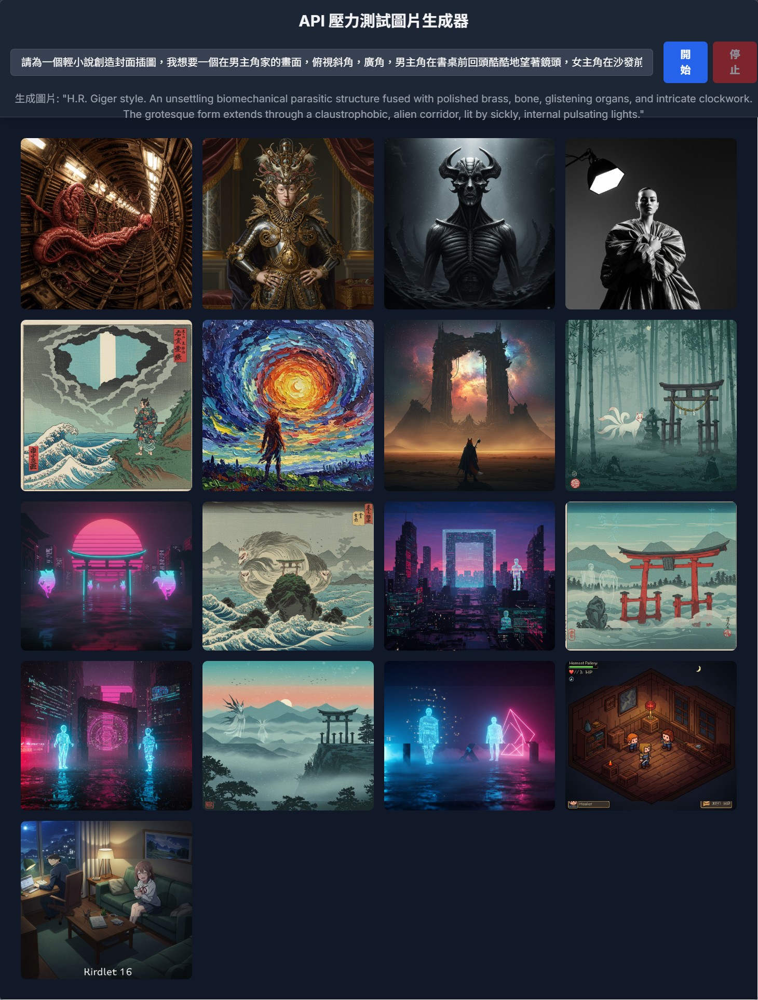

# API 壓力測試圖片生成器

## ⚠️ 重要警告

**請謹慎使用此工具！** 它會持續調用 API 直到手動停止，可能會：
- 快速消耗 API 配額
- 產生大量費用
- 觸發 API 限制

## 📖 功能介紹

這是一個用來測試 API 調用限制的自動化圖片生成工具，同時也可以作為創意靈感發掘工具。

### 🔄 核心機制

- **自動循環生成**：輸入初始描述後，工具會持續運行
- **創意演化**：每次生成都基於前一張圖片的 prompt 創造全新的創意
- **風格變化**：自動變換藝術風格，確保每張圖片都有不同視覺效果
- **即時顯示**：所有生成的圖片按時間順序展示

### 🎨 適用場景

#### 測試用途
- **API 限制測試**：了解 API 調用頻率限制
- **穩定性測試**：測試長時間連續調用的穩定性
- **配額監控**：觀察 API 使用量變化

#### 創意用途  
- **靈感發掘**：從一個簡單想法衍生出無數創意
- **風格探索**：觀察不同藝術風格的表現效果
- **創意鏈條**：追蹤創意如何從一個概念演化到另一個

### 🚀 使用方式

1. **輸入初始描述**：用中文描述你的第一個創意
2. **點擊開始**：工具開始自動生成圖片
3. **觀察演化**：每張新圖片都基於前一張的 prompt 創造
4. **隨時停止**：點擊停止按鈕結束生成

### 💡 使用技巧

- **有趣的起點**：選擇一個你感興趣的初始概念
- **觀察模式**：注意 AI 如何理解和演化你的創意
- **收集靈感**：將喜歡的圖片保存為創作參考

