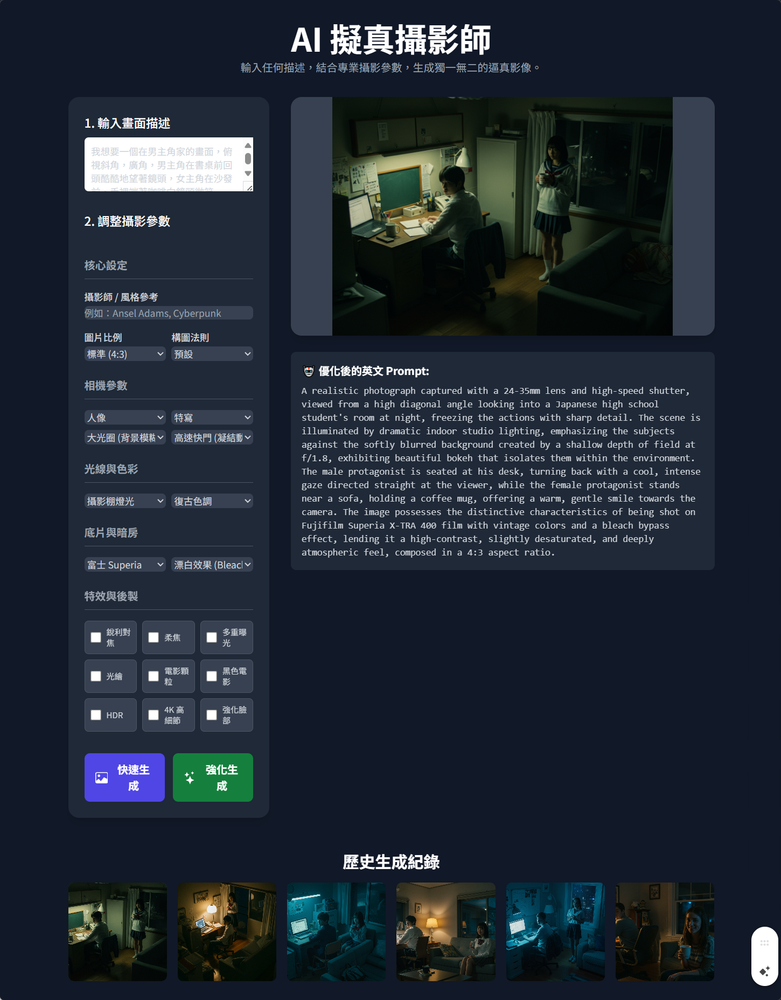

# 專業攝影生成工具

## 功能介紹

只需描述場景，選擇攝影參數，就能生成擬真攝影圖片。

### 主要特色
- **豐富參數**：各種攝影技術、設備、構圖、燈光的模板供選用
- **雙重模式**：
  - **快速生成**：原始 Prompt + 模板標籤直接生圖
  - **強化生成**：AI 消化 Prompt 與標籤後優化生圖
- **展示燈箱**：圖片全螢幕檢視
- **生成歷史**：完整保存作品紀錄

