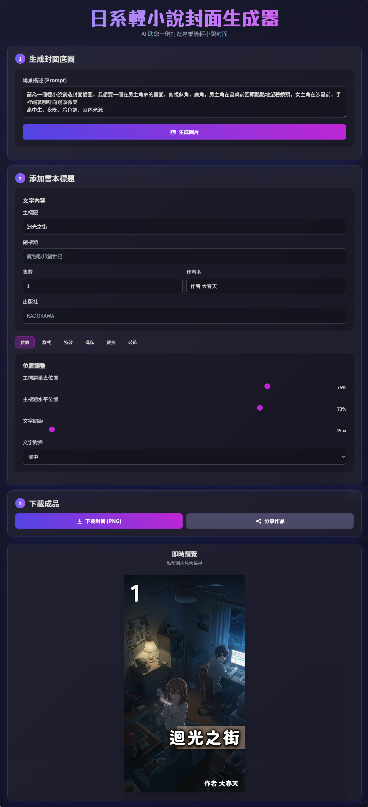

# 輕小說封面生成器

## 功能介紹

將圖片生成請求變成日系輕小說風格的封面，可在生成的圖片上添加標題、集數、作者等文字與特效並下載。

### 主要特色
- **日系風格**：專門生成輕小說封面底圖
- **文字編輯**：添加主標題、副標題、集數、作者、出版社
- **豐富特效**：文字樣式、陰影、發光、變形等效果
- **即時預覽**：所有調整立即顯示
- **完整下載**：輸出包含圖片與文字的完整封面

